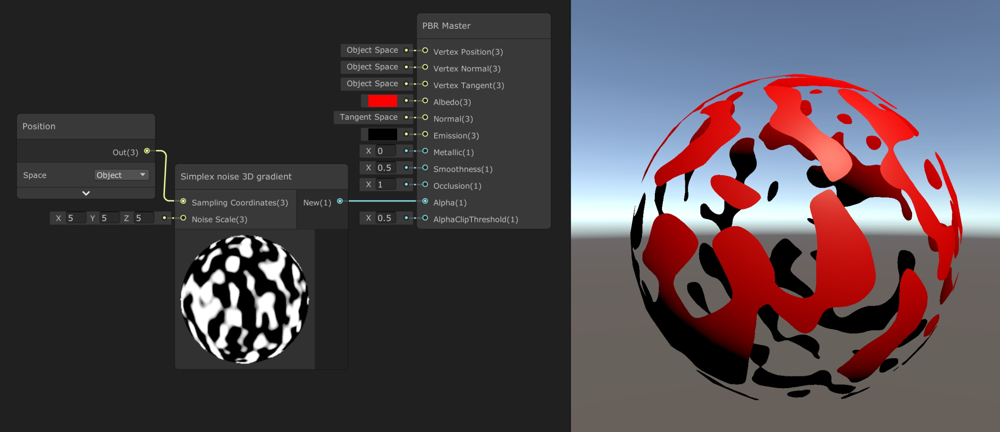

# Noisy Nodes
Adds various noise-generation nodes to Unity Shader Graph, including 3D noise nodes.

## List of nodes

### Perlin noise

Code from [Noise Shader](https://github.com/keijiro/NoiseShader) by  @keijiro

* Perlin noise 2D
* Perlin noise 2D periodic
* Perlin noise 3D
* Perlin noise 3D periodic

### Simplex noise

Code from [Noise Shader](https://github.com/keijiro/NoiseShader) by @keijiro

* Simplex noise 2D
* Simplex noise 2D gradient
* Simplex noise 3D
* Simplex noise 3D gradient

### Voronoi Noise 

Contributed by @fdervaux -- thank you! -- and based on [this tutorial](https://cyangamedev.wordpress.com/2019/07/16/voronoi/)

* Voronoi noise 2D
* Voronoi noise 3D
* Voronoi noise 4D
* Voronoi precise noise 2D
* Voronoi precise noise 3D
* Voronoi precise noise 4D

### White Noise

Contributed by @fdervaux -- thank you! -- and based on [this tutorial](https://www.ronja-tutorials.com/2018/09/02/white-noise.html)

* White noise 2D
* White noise 3D

## Installation

Download the whole repo and stick it in your project's `Assets` or `Packages` folder.

Alternatively, Noisy Nodes can be installed via the Unity Package Manager. In the top left of the `Packages` window, navigate to `Add Package -> Add package from git URL` and paste `https://github.com/JimmyCushnie/Noisy-Nodes.git`.
